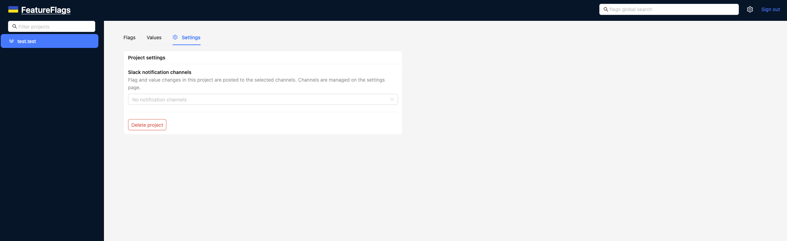
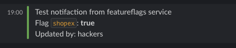

Notifications
=============

FeatureFlags can send project change notifications to Slack by using incoming
webhooks.

What it is
----------

Notifications let a team see feature flag and value changes without watching
the FeatureFlags UI all the time. After a notification channel is configured
and attached to a project, FeatureFlags posts updates to Slack when somebody
changes flags or values in that project.

Typical use cases:

- tracking who enabled or disabled a flag
- seeing value override changes in shared channels
- auditing project changes during releases
- testing a webhook before using it in production

Currently, notification delivery uses Slack incoming webhooks.

How it works
------------

There are two levels of configuration:

1. **Global notification channels** — reusable channel definitions with a name
   and Slack webhook URL
2. **Project channel selection** — each project can use one or more of the
   global channels

A change in a project is sent to every notification channel selected for that
project.

Configure a notification channel
--------------------------------

Open the **Notification channels** page in the UI and create a channel with:

- a human-readable name
- a Slack incoming webhook URL

You can also use the **Send test** button before saving to verify that the
webhook works.

Suggested naming examples:

- ``team-alerts``
- ``release-notifications``
- ``backend-flags``

Use notification channels in a project
--------------------------------------

After a channel is created, open the target project's settings and select one
or more channels in **Slack notification channels**.

Once selected, all supported changes in that project will be posted to the
chosen Slack channels.

What changes are sent
---------------------

FeatureFlags sends notifications for project flag and value updates, including
common actions such as:

- enabling a flag
- disabling a flag
- resetting a flag
- deleting a flag
- enabling a value
- disabling a value
- resetting a value
- deleting a value
- updating conditions and value overrides

The message includes the changed entity name, the project name, and the user
who made the update. When conditions are involved, the rendered condition
details are included in the Slack message.

Slack message example
---------------------

A Slack message is posted to the selected channel after a change is made.

A test notification is also available from the notification channel form. It is
useful for validating webhook access and confirming that the Slack destination
is correct before attaching the channel to projects.

Recommended setup flow
----------------------

1. Create a Slack incoming webhook
2. Add a notification channel in FeatureFlags
3. Use **Send test** to verify delivery
4. Open a project and select the channel in project settings
5. Change a flag or value in that project
6. Verify the message in Slack

Notes
-----

- Notification channels are managed globally and reused across projects
- A project can send notifications to multiple Slack channels
- If no channel is selected for a project, no Slack notifications are sent
- Webhook URL validation requires an ``http://`` or ``https://`` URL
